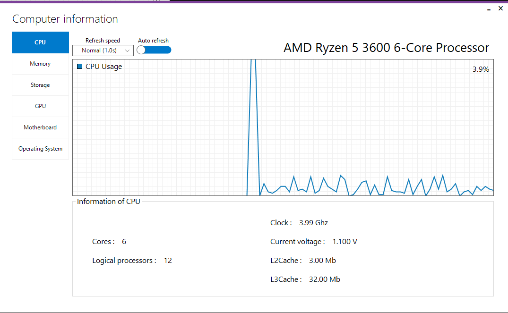
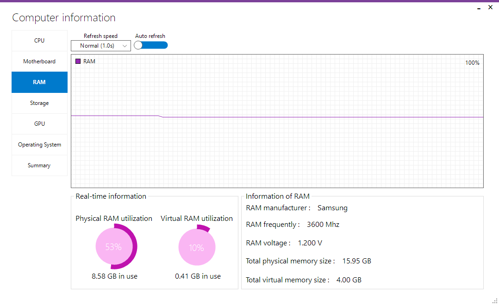
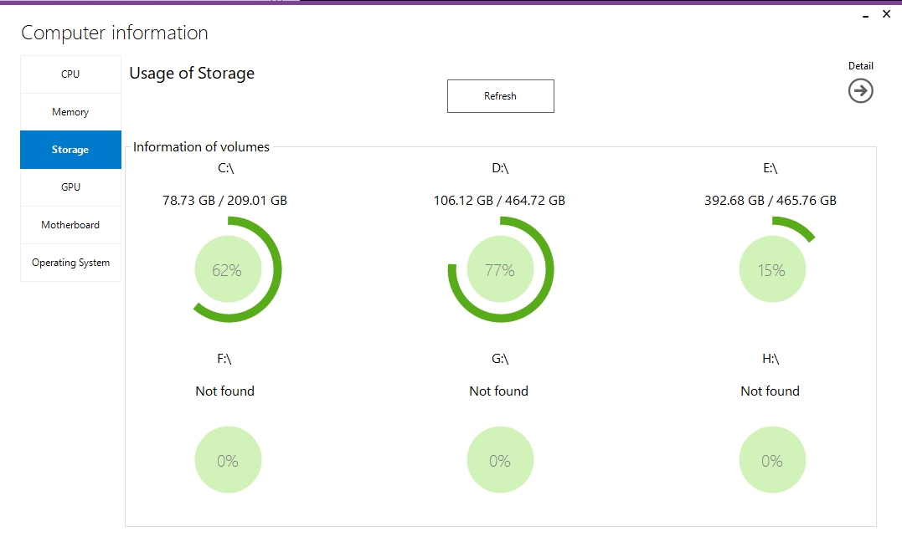
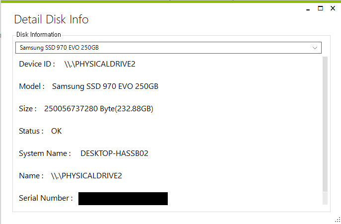
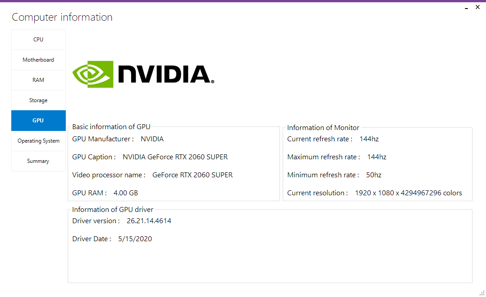
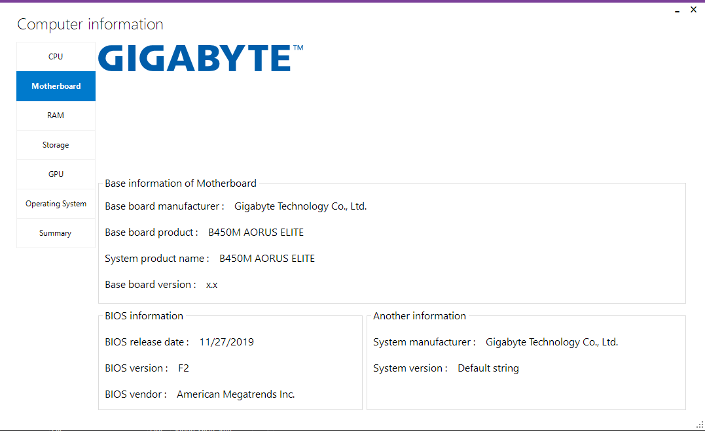
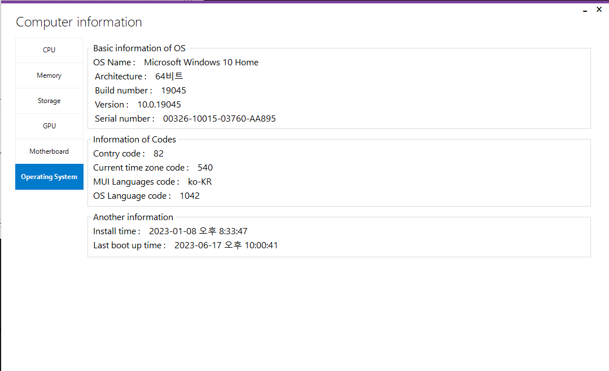

# ComputerInfo
Get your computer's hardware information with C#

This program will get various HW data from your PC and show it.

Main form skin : MetroFrameWork

Control skins
  MetroSuite 
  http://www.vb-paradise.de/index.php/Thread/81271-metrocontrols-update-01-11-holt-euch-den-modernen-windows-8-style/
  
  GChartLib 
  http://www.vb-paradise.de/index.php/Thread/118123-GChartLib-Pr%C3%A4sentiert-Daten-auf-eine-neue-moderne-Art/#59da2a65195c6_1
  

