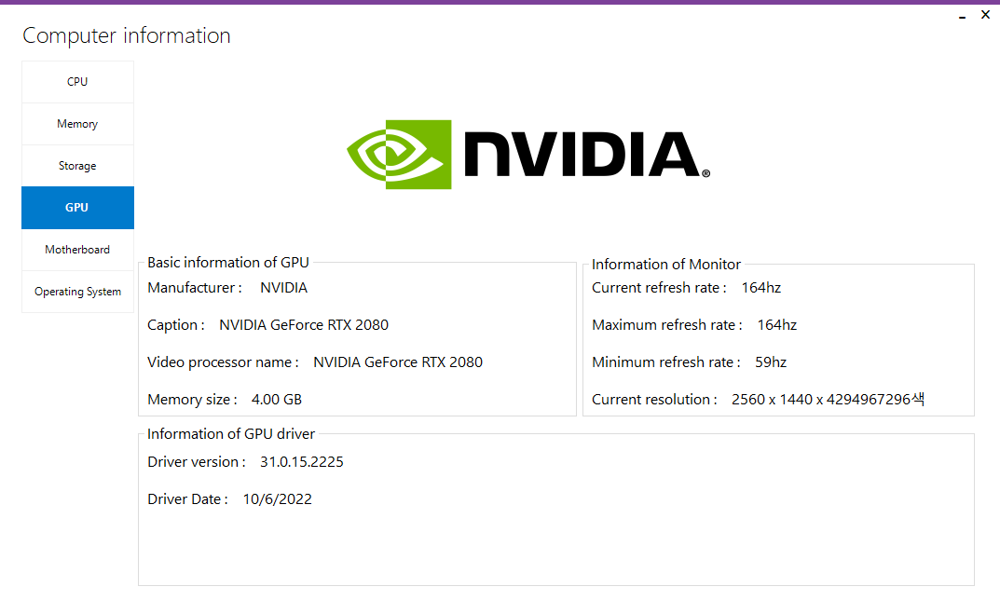
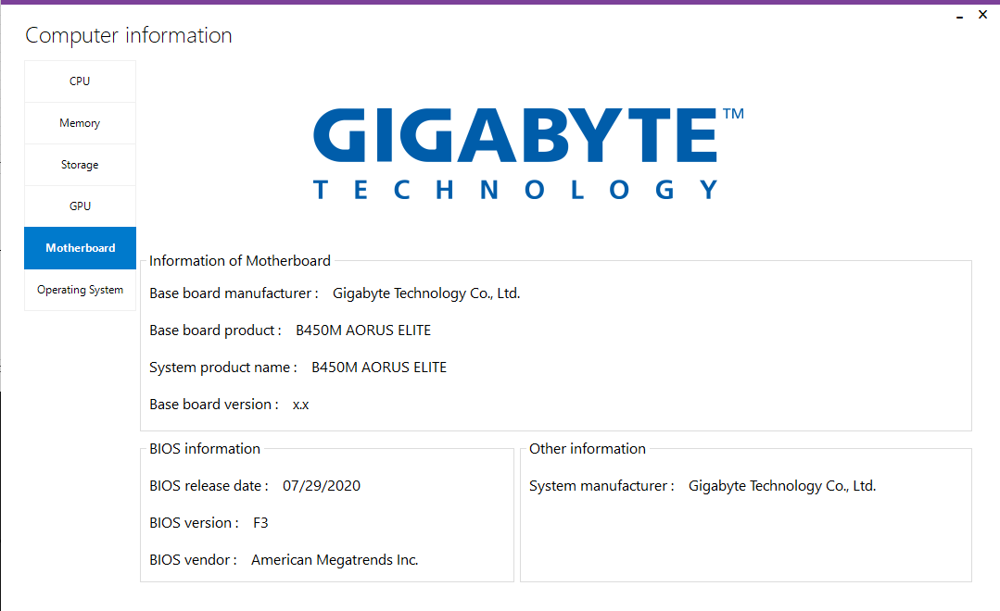
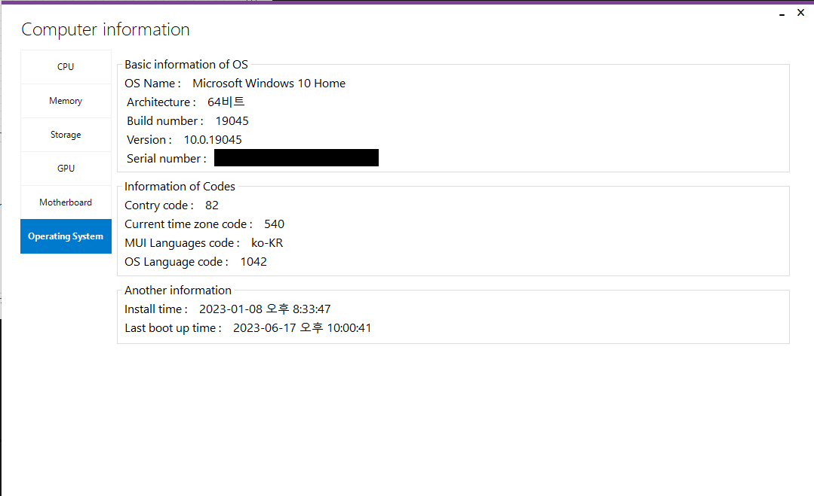

# ComputerInfo
Get your computer's hardware information with C#

This program will get various hardware data from your PC and display it with a modern, intuitive interface.

## Features

- 📊 **CPU Monitoring**: Real-time CPU usage, clock speed, voltage, and cache information
- 💾 **Memory Information**: Physical and virtual memory usage with live graphs
- 💿 **Storage Details**: Disk usage visualization with circular progress indicators
- 🎮 **GPU Information**: Graphics card details, driver version, and monitor specifications
- 🖥️ **Motherboard Data**: Manufacturer and model information
- ⚙️ **Operating System**: Detailed OS information including version, architecture, and language settings

## Prerequisites

Before you begin, ensure you have the following installed:

- **Windows OS**: Windows 7 or later (Windows 10/11 recommended)
- **Visual Studio**: Visual Studio 2017 or later with .NET Framework 4.8 SDK
- **.NET Framework 4.8**: Required runtime for the application

## How to Install

### Step 1: Clone the Repository

```bash
git clone https://github.com/SalkCoding/ComputerInfo.git
cd ComputerInfo
```

### Step 2: Obtain Required Dependencies

⚠️ **Important**: This project requires two custom UI libraries that are not included in the repository:

1. **GChartLib** - Chart visualization library
2. **MetroSuite 2.0** - Modern Windows 8 style controls

**Detailed instructions for obtaining these dependencies can be found in [DEPENDENCY_GUIDE.md](./DEPENDENCY_GUIDE.md)**

#### Quick Summary:

These libraries are available from the VB Paradise forum:
- **MetroSuite 2.0**: http://www.vb-paradise.de/index.php/Thread/81271-metrocontrols-update-01-11-holt-euch-den-modernen-windows-8-style/
- **GChartLib**: http://www.vb-paradise.de/index.php/Thread/118123-GChartLib-Pr%C3%A4sentiert-Daten-auf-eine-neue-moderne-Art/#59da2a65195c6_1

After downloading:
1. Create a `lib` folder in the project root
2. Place `GChartLib.dll` in `lib/GChartLib/`
3. Place `MetroSuite 2.0.dll` in `lib/MetroSuite/`
4. Update the reference paths in `ComputerInfo.csproj` to point to `lib` folder

See [DEPENDENCY_GUIDE.md](./DEPENDENCY_GUIDE.md) for detailed step-by-step instructions and troubleshooting.

### Step 3: Restore NuGet Packages

Open the solution in Visual Studio and restore NuGet packages:

```bash
# Using Visual Studio: Right-click solution → Restore NuGet Packages
# Or using command line (if NuGet CLI is installed):
nuget restore
```

The following packages will be automatically restored:
- MetroFramework (v1.4.0.0)
- MaterialSkin (v0.2.1)
- System.Management (v4.7.0)

### Step 4: Build the Project

```bash
# In Visual Studio: Build → Build Solution (Ctrl+Shift+B)
# Or using MSBuild:
msbuild ComputerInfo.sln /p:Configuration=Release
```

## Quick Start

### Running the Application

1. **Open in Visual Studio**:
   - Double-click `ComputerInfo.sln`
   - Press `F5` to run with debugging, or `Ctrl+F5` to run without debugging

2. **Run from Command Line**:
   ```bash
   cd ComputerInfo/bin/Release
   ComputerInfo.exe
   ```

### Using the Application

1. **Launch**: Start the application - it will automatically begin collecting system information
2. **Navigate Tabs**: Click on different tabs to view various hardware information:
   - **CPU**: View processor details and real-time usage graph
   - **Memory**: Check physical and virtual memory usage
   - **Storage**: See disk usage for all drives with visual indicators
   - **GPU**: View graphics card and monitor information
   - **Motherboard**: Check motherboard details
   - **Operating System**: View OS information and settings

3. **Refresh Rate**: Use the dropdown menu to adjust the data refresh rate (Normal/Fast)
4. **Auto Refresh**: Toggle auto-refresh to enable/disable automatic data updates
5. **Storage Details**: Click the "Detail" button on the Storage tab for detailed disk information

## UI Libraries

This project uses the following UI frameworks:

- **MetroFramework**: Main form styling and base UI components (included via NuGet)
- **MetroSuite 2.0**: Additional metro-style controls (requires manual installation)
- **GChartLib**: Modern chart and circular progress visualizations (requires manual installation)
- **MaterialSkin**: Material design components (included via NuGet)

## Screenshots


*CPU monitoring with real-time usage graph*


*Memory usage tracking for physical and virtual memory*


*Storage usage visualization with circular progress indicators*


*Detailed storage device information*


*GPU and monitor specifications*


*Motherboard information*


*Operating system details*

## Troubleshooting

### Build Errors Related to Missing References

If you see errors about missing `GChartLib` or `MetroSuite 2.0`:
- Refer to [DEPENDENCY_GUIDE.md](./DEPENDENCY_GUIDE.md) for detailed installation instructions
- Ensure the DLL files are in the correct location
- Verify the reference paths in `ComputerInfo.csproj`

### Application Not Starting

- Ensure .NET Framework 4.8 is installed
- Run as Administrator if accessing hardware information fails
- Check Windows Event Viewer for detailed error information

### Incorrect Hardware Information

- Some hardware details require WMI (Windows Management Instrumentation)
- Ensure WMI service is running: `services.msc` → Windows Management Instrumentation
- Run the application as Administrator for full hardware access

## Contributing

Contributions are welcome! Please feel free to submit issues or pull requests.

## License

This project is licensed under the MIT License - see the [LICENSE](LICENSE) file for details.

## Acknowledgments

- **MetroFramework**: For the modern UI framework
- **VB Paradise Community**: For GChartLib and MetroSuite 2.0 libraries
- All contributors who have helped improve this project
